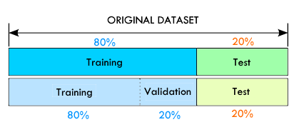
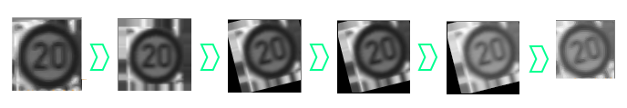
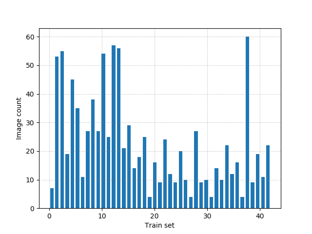
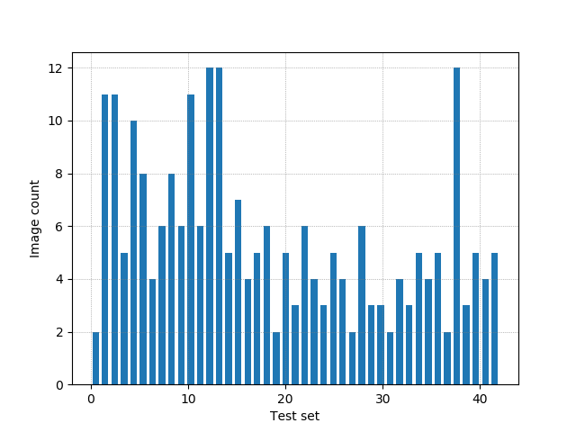
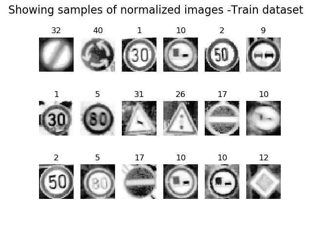
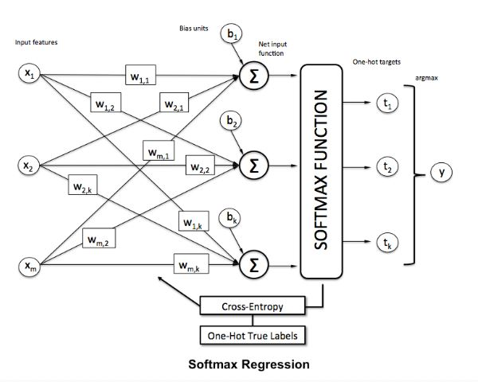
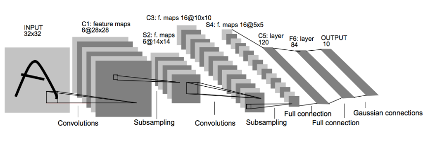
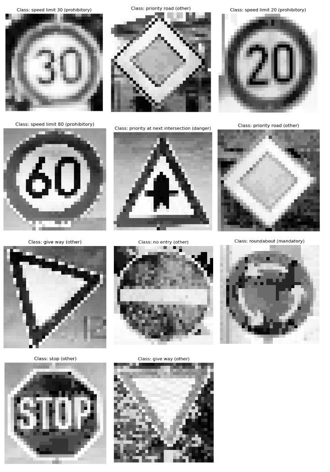

# The German Traffic Sign Detection Benchmark Using Scikit-learn and TensorFlow for kiwi Campus

**German Traffic Signs Detector the deep learning challenge for [Kiwi Campus](https://kiwicampus.com/).**

## Overview:

In this project, I used Python, Scikit-learn and TensorFlow to classify traffic signs.

The models will be trained and validated using the [German Traffic Sign Detection Dataset](http://benchmark.ini.rub.de/?section=gtsdb&subsection=dataset).
This dataset has more than 900 images of 43 classes.

**This project has 3 models:**

- **model 1 =** Logistic regression model using scikit-learn. (**85.77%** validation accuracy, and a **89.03%** testing accuracy)
- **model 2 =** Logistic regression model using TensorFlow. (**86.61%** validation accuracy, and a **89.36%** testing accuracy)
- **model 3 =** LeNet model using TensorFlow.  (**94.97%** validation accuracy, and a **96.34%** testing accuracy)

## Pipeline architecture:
- **Download The Data.**
- **Explore, summarize and visualize the dataset**
- **Data Preprocessing**.    
    - Grayscaling.
    - Local Histogram Equalization.
    - Normalization.
- **Design a Model Architecture.**
    - Logistic regression model using scikit-learn.
    - Logistic regression model using TensorFlow.
    - LeNet-5 using TensorFlow.
    
- **Model Training and Evaluation** (Train folder).
- **Testing the Model Using the Test Set** (Test folder).
- **Testing the Model on New Images** (User folder).


#### Environement:
-  Windows 10
-  Python 3.5.2

#### Dependencies:

-  TensorFlow 1.7.0 (GPU support)
-  Scikit-learn 0.19.1
-  Scikit-image 0.13.1
-  OpenCV 3.4.0.12
-  Click 6.7
-  Pickle 0.7.4
-  Numpy 1.14.3
-  Matplotlib 2.2.2

---
## Step 1: Download The Data

I create a `download command` that will download all data from [German Traffic Sign Detection Dataset](http://benchmark.ini.rub.de/?section=gtsdb&subsection=dataset). This will unzip images and store the the dataset inside an images folder.

-   From the total of the images in the dataset, The code count the samples in each class and if this contains few images on a class, the code create more images, its called Balance data. 
-   Later the code split 80% for training and 20% for testings of each class (It makes to train models later).
-   The train folder contain images for training the models. 
-   The test folder have images on which I validate the models.
-   The user folder is for put images to make tests on the models.

### Split data:

<figure>
 
 <figcaption>
 <p></p> 
 </figcaption>
</figure>

### Balance data:

The database has unbalanced files, so I decided to increase the database, in the classes that have less than 15 samples.

The increase of images is done in the following way:

-  Augment borders of image and resize to 80x80
-  Rotate image
-  Translate image
-  Random bright
-  Crop image and resize to 32x32
-  Create train_file.csv and test_file.csv

<figure>
 
 <figcaption>
 <p></p> 
 </figcaption>
</figure>

#### Visualize samples of the generated images

-  First column is the original image.
-  Second column is a created image.
-  Third column is a created image.

<figure>
 
 <figcaption>
 <p></p> 
 </figcaption>
</figure>

### Executing download comand:

`python app.py download`

```
Downloading dataset
Downloading train images and test images... (This process can take several minutes)
Download complete!
Extracting files
Saving files on train and test folder
Train folder: 1212  Test folder: 301
```

---

## Step 2: Explore, summarize and visualize the dataset

The train and test folder has `.csv` that content the image ID and their class.

`train_file.csv` It has 1212 images (32x32x1).

```
0000.ppm	0
0001.ppm	0
0002.ppm	0
0003.ppm	0
0004.ppm	0
0005.ppm	0
0006.ppm	0
0007.ppm	0
0008.ppm	0
0009.ppm	1
0010.ppm	1
```


**Plot a histogram of train folder.**


<figure>
 
 <figcaption>
 <p></p> 
 </figcaption>
</figure>

**Plot a histogram of test folder.**

<figure>
 
 <figcaption>
 <p></p> 
 </figcaption>
</figure>

---

## Step 3: Data Preprocessing

In this step, we will apply several preprocessing steps to the input images to achieve the best possible results.

**We will use the following preprocessing techniques:**
1. Grayscaling.
2. Local Histogram Equalization.
3. Normalization.


**1. Grayscaling**: I use `OpenCV` to convert the training images into grey scale.

**2. Local Histogram Equalization**: Spreads out the most frequent intensity values in an image, resulting in enhancing images with low contrast. 

<figure>
 
 <figcaption>
 <p></p> 
 </figcaption>
</figure>

**3. Normalization**: Normalization is a process that changes the range of pixel intensity values.

<figure>
 
 <figcaption>
 <p></p> 
 </figcaption>
</figure>

---

## Step 3: Design a Model Architecture

I'll use Logistic regression and Convolutional Neural Networks to classify the images in this dataset.

I'll start by explaining each network architecture, then implement it using TensorFlow.

### 1.  Logistic regression
Logistic regression is named for the function used at the core of the method, the logistic function. In linear regression, the outcome (dependent variable) is continuous. It can have any one of an infinite number of possible values. In logistic regression, the outcome (dependent variable) has only a limited number of possible values. Logistic Regression is used when response variable is categorical in nature.

#### Logistic regression in Scikit-learn architecture:
```
Tolerance for stopping criteria = 0.0001
Maximum number of iterations = 1000

```
Number of inputs = 1024, that correspond to the flatten image.

Number of outputs = 43, thath correspond to each class.
```
LogisticRegression(C=1.0, class_weight=None, dual=False, fit_intercept=True,
          intercept_scaling=1, max_iter=1000, multi_class='ovr', n_jobs=1,
          penalty='l2', random_state=None, solver='liblinear', tol=0.0001,
          verbose=0, warm_start=False)
```
#### Logistic regression in TensorFlow:

<figure>
 
 <figcaption>
 <p></p> 
 </figcaption>
</figure>

```
# Parameters
learning_rate = 0.05
training_epochs = 1000
batch_size = 64
display_step = 1
```
```
-  Input layer: Must be 32x32 = 1024 inputs.
-  Output layer: Must be 43 output that represent the classes.
-  Weight matriz: The dimension will be [1024,43]
-  Bias: The dimension will be [43]
```

### 3.  LeNet-5
LeNet-5 is a convolutional network designed for handwritten and machine-printed character recognition in the year 1998. It was introduced by Yann LeCun, in his paper [Gradient-Based Learning Applied to Document Recognition](http://yann.lecun.com/exdb/publis/pdf/lecun-01a.pdf). 

**LeNet-5 architecture:**

In the paper we can see this structure propose by Yann LeCun:

<figure>
 
 <figcaption>
 <p></p> 
 </figcaption>
</figure>

Input => Convolution => ReLU => Pooling => Convolution => ReLU => Pooling => FullyConnected => ReLU => FullyConnected

Layer 1 (Convolutional): The output shape should be 28x28x6.

Activation. Your choice of activation function.

Pooling. The output shape should be 14x14x6.

Layer 2 (Convolutional): The output shape should be 10x10x16.

Activation. Your choice of activation function.

Pooling. The output shape should be 5x5x16.

Flattening: Flatten the output shape of the final pooling layer such that it's 1D instead of 3D.

Layer 3 (Fully Connected): This should have 120 outputs.

Activation. Your choice of activation function.

Layer 4 (Fully Connected): This should have 84 outputs.

Activation. Your choice of activation function.

Layer 5 (Fully Connected): This should have 10 outputs.


---

## Step 4: Model Training and Evaluation

We use click library for develop the project, so if we use:
```
python app.py --help
```
The output is:
```
Usage: app.py [OPTIONS] COMMAND [ARGS]...

Options:
  --help  Show this message and exit.

Commands:
  download  Download the GTSDB dataset
  test      Test model
  train     Train model
```
Now we can see options of the comands, for example the train comand
```
python app.py train --help
```
The output is:
```
Usage: app.py train [OPTIONS]

  Train model

Options:
  -m TEXT  Here you choose the model (model_1, model_2, model_3)
  -d TEXT  Here you choose the path of directory
  -p TEXT  True to plot samples of images during the preprocess
  --help   Show this message and exit.
```
So, `-m` is for select one model, `-d` is for add path of the directory and `-p` is for debuging mode and plot during the process.

### Logistic regression with Scikit-learn

For **model 1** we have to put the following comand:
```
python app.py train -m model_1 -d images/train
```
The output will be the accuracy of model 1:
```
Model is logistic regression with scikit-learn
Train accuracy of model 1 is: 85.77405857740585
```
We've been able to reach a maximum accuracy of **85.77%** on the validation set.

### Logistic regression with TensorFlow

For **model 2** we have to put the following comand:
```
python app.py train -m model_2 -d images/train
```
The output will be the accuracy of model 2:
```
Epoch: 0 cost=6.138635533196585 Accuracy of epoch is:0.016736401
Epoch: 50 cost=1.5487551603998457 Accuracy of epoch is:0.64853555
Epoch: 100 cost=0.7987359251294818 Accuracy of epoch is:0.76987445
Epoch: 150 cost=0.5192108750343323 Accuracy of epoch is:0.8117155
Epoch: 200 cost=0.37372345903090076 Accuracy of epoch is:0.83682007
Epoch: 250 cost=0.28807814099958967 Accuracy of epoch is:0.8535565
Epoch: 300 cost=0.23311320479427067 Accuracy of epoch is:0.8535565
Epoch: 350 cost=0.19514039903879166 Accuracy of epoch is:0.8535565
Epoch: 400 cost=0.16744607846651757 Accuracy of epoch is:0.8577406
Epoch: 450 cost=0.14643785410693713 Accuracy of epoch is:0.8619247
Optimization Finished!
Train accuracy of model 2 is:86.6108775138855
Elapsed time: 15.973098754882812 seconds
Model saved to: models/model2/saved/log_reg_tF.ckpt
```
We've been able to reach a maximum accuracy of **86.61%** on the validation set.

### LeNet Model 

For **model 3** we have to put the following comand:
```
python app.py train -m model_3 -d images/train
```
The output will be the accuracy of model 3:
```
Training LaNet network...
EPOCH 0 Validation Accuracy :4.602510460251046
EPOCH 10 Validation Accuracy :37.23849351186633
EPOCH 20 Validation Accuracy :68.20083716923223
EPOCH 30 Validation Accuracy :76.56903795617394
EPOCH 40 Validation Accuracy :80.75313827482726
EPOCH 50 Validation Accuracy :91.21338922109564
EPOCH 60 Validation Accuracy :94.5606695059453
EPOCH 70 Validation Accuracy :87.86610878661088
EPOCH 80 Validation Accuracy :93.7238494222633
EPOCH 90 Validation Accuracy :93.30543943030067
EPOCH 100 Validation Accuracy :94.14225951398268
EPOCH 110 Validation Accuracy :94.14225951398268
EPOCH 120 Validation Accuracy :94.56066955582368
EPOCH 130 Validation Accuracy :94.56066955582368
EPOCH 140 Validation Accuracy :94.97907959766468
EPOCH 150 Validation Accuracy :94.97907959766468
EPOCH 160 Validation Accuracy :94.97907959766468
EPOCH 170 Validation Accuracy :94.97907959766468
EPOCH 180 Validation Accuracy :94.97907959766468
EPOCH 190 Validation Accuracy :94.97907959766468
EPOCH 199 Validation Accuracy :94.97907959766468
Train accuracy of model 3 is: 94.97907959766468
Model saved in models/model3/saved/LeNet_tF.ckpt
```
We've been able to reach a maximum accuracy of **94.97%** on the validation set.

---

## Step 5: Testing the Model using the Test Set

### Logistic regression with Scikit-learn

For **model 1** we have to put the following comand:
```
python app.py test -m model_1 -d images/test
```
The output will be the accuracy of model 1:
```
Model is logistic regression with scikit-learn
Test accuraccy of model 1 is: 89.03654485049833
```
We've been able to reach a maximum accuracy of **89.03%** on the test set.

### Logistic regression with TensorFlow

For **model 2** we have to put the following comand:
```
python app.py test -m model_2 -d images/test
```
The output will be the accuracy of model 2:
```
Model restored
Test accuraccy of model 2 is: 89.36877250671387
```
We've been able to reach a maximum accuracy of **89.36%** on the test set.

### LeNet Model 

For **model 3** we have to put the following comand:
```
python app.py test -m model_3 -d images/test
```
The output will be the accuracy of model 3:
```
Model restored
Test accuraccy of model 3 is: 96.3455149501661
```
We've been able to reach a maximum accuracy of **96.34%** on the test set.

---

## Step 6: Testing the Model on New Images

I test the 3 models to predict German traffic signs, I use 11 random images from the web with different image format (.ppm .png .jpg).

**You can put images here to test the models.**

The images at user folder are the following:

<figure>
 
 <figcaption>
 <p></p> 
 </figcaption>
</figure>

In this case, I test one model that is The LeNet (model 3), I excecute the following command.

```
python app.py infer -m model_3 -d images/user
```
This command plot the images in the folder and the LeNet predict the class.

<figure>
 
 <figcaption>
 <p></p> 
 </figcaption>
</figure>


